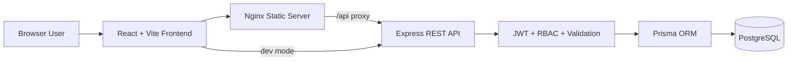

# Architecture Diagram

## Architectural Notes

- Frontend is a responsive SPA with lazy-loaded route modules.
- Backend exposes RESTful resources for auth, dashboard, projects, users, tasks, and comments.
- Prisma maps the relational PostgreSQL schema and protects query composition against SQL injection.
- Security middleware includes rate limiting, Helmet headers, HPP, JWT auth, bcrypt hashing, and Zod validation.
- Docker Compose orchestrates frontend, backend, and database as separate services.
