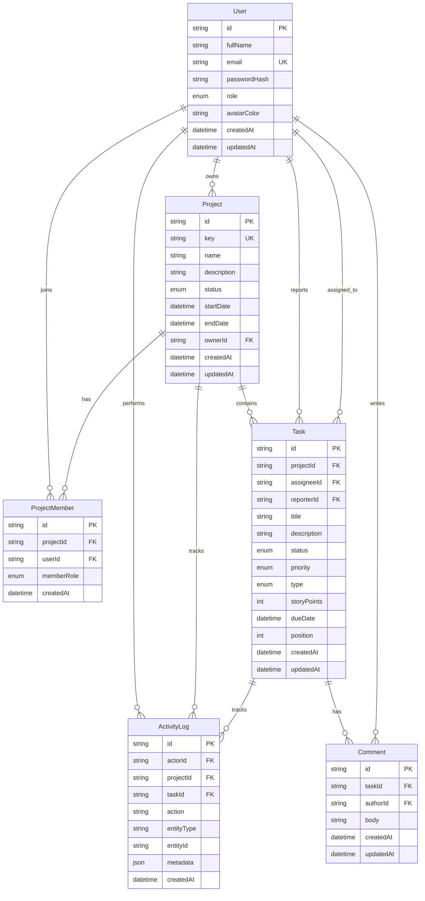

# Database Schema Diagram

## Normalization Summary

- `users`, `projects`, and `tasks` store primary entities only.
- `project_members` resolves the many-to-many relation between users and projects.
- `comments` are separated from tasks to avoid repeated text columns in task rows.
- `activity_logs` store audit-style timeline events independently from business entities.

## Indexing Summary

- `users.email`, `projects.key`, and the `projectId + userId` membership pair are unique.
- Lookup indexes exist for user role, project status, owner, task assignee, task reporter, task status/priority, and activity timestamps.
- These indexes support dashboard counts, filtering, and pagination queries efficiently.
